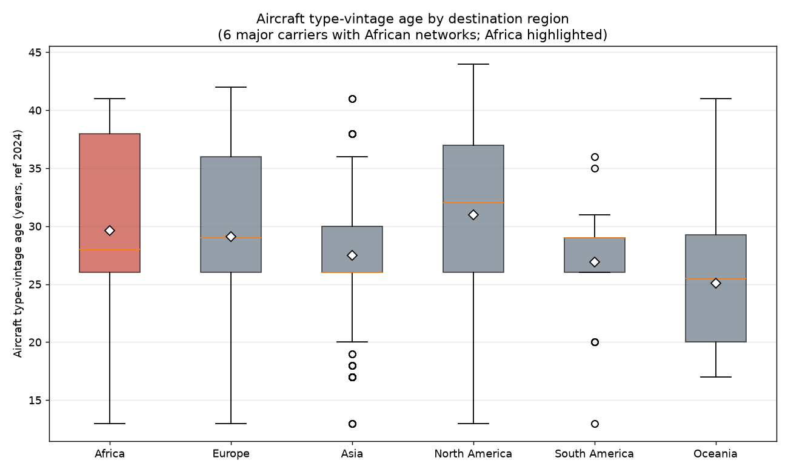
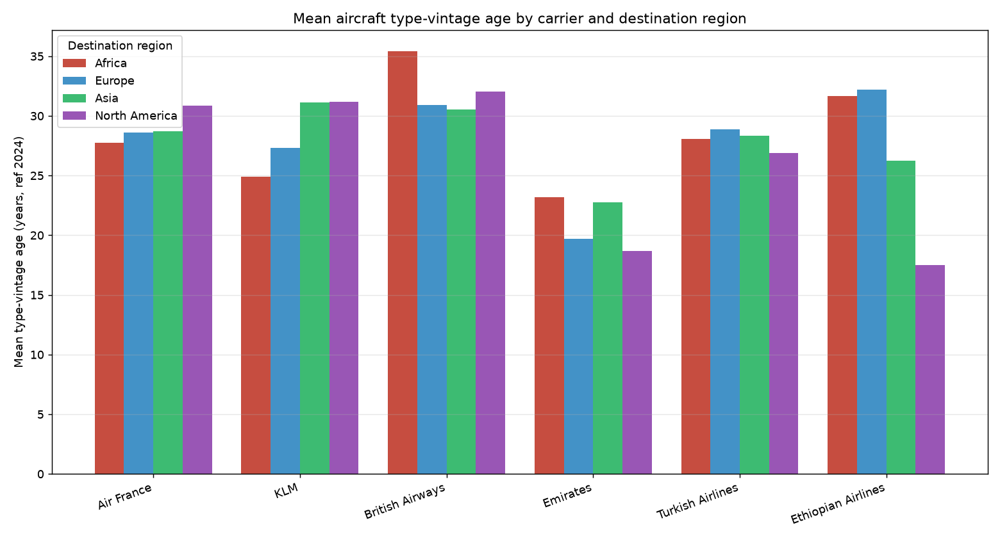
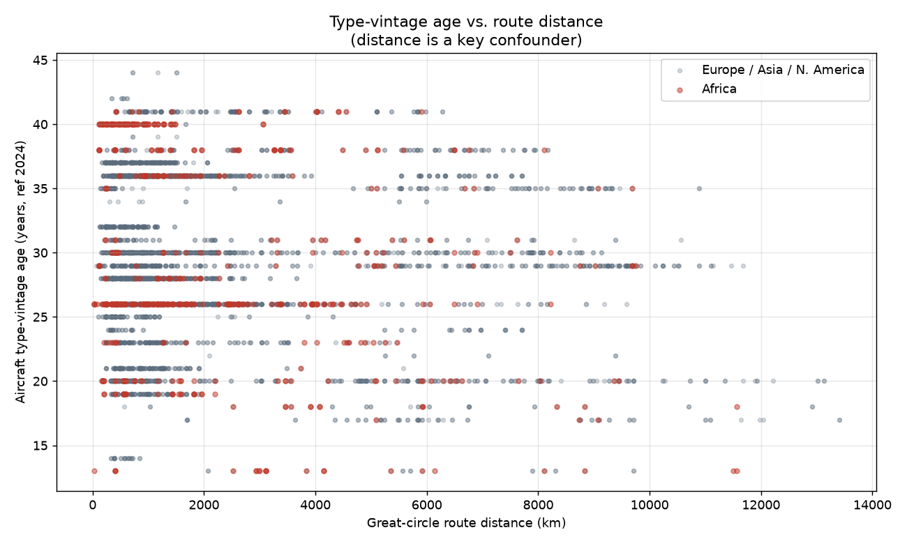
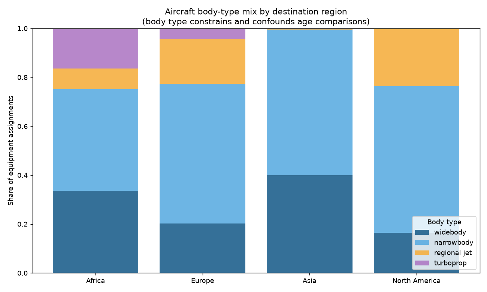

# Findings: aircraft age on African routes vs. other regions

**Question.** Do major international carriers systematically fly *older* aircraft
on routes to Africa than on comparable routes to Europe, Asia, and North America?

**Data.** Real route + equipment data from OpenFlights for six carriers (Air
France, KLM, British Airways, Emirates, Turkish Airlines, Ethiopian Airlines),
covering **6,006 equipment-assignment observations** across regions
(Africa = 608, Europe = 2,274, Asia = 1,461, North America = 1,547, plus small
South America / Oceania samples). Aircraft age is measured as **type-vintage
age** = 2024 − the entry-into-service year of the assigned aircraft type (see
README for why per-airframe age is not obtainable in this environment).

All numbers below are produced by `run_analysis.py`; see
[`outputs/stats_report.txt`](outputs/stats_report.txt).

---

## 1. Headline result: no broad "older to Africa" effect at the type level

Mean type-vintage age by destination region (all six carriers pooled):

| Region | n | Mean age (yr) | Median | Mean distance (km) | Widebody share |
|---|---:|---:|---:|---:|---:|
| North America | 1,547 | **30.97** | 32 | 1,945 | 0.16 |
| **Africa** | 608 | **29.63** | 28 | 2,178 | 0.34 |
| Europe | 2,274 | 29.10 | 29 | 2,095 | 0.20 |
| Asia | 1,461 | 27.49 | 26 | 2,632 | 0.40 |
| South America | 60 | 26.92 | 29 | 4,902 | 0.68 |
| Oceania | 56 | 25.11 | 26 | 4,610 | 0.70 |

Africa ranks **second**, not first — narrowly above Europe and *below* North
America. The Africa-vs-comparison gap is small and not significant:

- Mean difference: **+0.43 years** (Africa 29.63 vs. comparison 29.20)
- Welch's *t*-test: *p* = **0.20**; Mann-Whitney U: *p* = 0.33
- Cohen's *d* = **0.07** (negligible)



---

## 2. The effect is carrier-specific, not universal

Pooling hides sharply different carrier behaviour (Africa vs. Europe/Asia/N.America):

| Carrier | n(Afr) | Mean Africa | Mean other | Diff (yr) | Welch *p* | Cohen's *d* |
|---|---:|---:|---:|---:|---:|---:|
| **British Airways** | 57 | 35.40 | 31.04 | **+4.36** | <0.001 | +0.74 |
| Ethiopian Airlines | 271 | 31.66 | 30.47 | +1.20 | 0.11 | +0.15 |
| Emirates | 28 | 23.18 | 22.23 | +0.95 | 0.29 | +0.23 |
| Turkish Airlines | 66 | 28.06 | 28.42 | −0.36 | 0.64 | −0.09 |
| Air France | 99 | 27.76 | 29.57 | **−1.81** | 0.002 | −0.29 |
| **KLM** | 87 | 24.92 | 30.02 | **−5.10** | <0.001 | −0.85 |

- **British Airways** is the one carrier that clearly matches the hypothesis:
  markedly older-vintage types to Africa (large effect, *d* = 0.74).
- **KLM and Air France run the opposite pattern** — *younger*-vintage types to
  Africa than to their other regions.
- **Emirates and Turkish** show no significant difference.



---

## 3. Controlling for confounders erases the overall gap

OLS regression, HC3 robust SEs, carrier fixed effects, restricted to Africa +
comparison regions (n = 5,890):

```
type_vintage_age ~ is_africa + distance_1000km + is_widebody + connectivity_100 + C(airline)
```

| Term | Coef (yr) | *p* |
|---|---:|---:|
| **is_africa** | **−0.15** | **0.65** |
| distance_1000km | −0.25 | <0.001 |
| is_widebody | +0.32 | 0.26 |
| connectivity_100 | +0.14 | <0.001 |
| Emirates (vs Air France) | −6.74 | <0.001 |
| British Airways | +2.10 | <0.001 |
| Ethiopian | +2.03 | <0.001 |

After accounting for route distance, body type, destination demand, and carrier
identity, the African-route coefficient is **−0.15 years and statistically
indistinguishable from zero**. In other words, once you compare like-for-like
routes, there is *no* general African age penalty in this dataset.

The controls behave sensibly: **longer routes carry newer-vintage aircraft**
(−0.25 yr / 1,000 km, *p* < 0.001), the standard long-haul-widebody-renewal
pattern. This is exactly the confounder the raw regional means mask —
see the distance scatter and the body-type mix:




---

## 4. The tail-level design would detect what type data cannot

The type-vintage proxy is blind to the most plausible version of the hypothesis:
a carrier operating the *same type* everywhere but sending its **oldest
individual airframes** to Africa. To validate that the airframe-level pipeline
works, `synthetic_fleet.py` injects a known **+2.5-year Africa premium** into
simulated tail data; the regression recovers it cleanly:

- `is_africa` coefficient = **+2.83 years**, *p* < 0.001 (see
  [`outputs/tail_level_demo_report.txt`](outputs/tail_level_demo_report.txt)).

**These tail-level numbers are simulated and illustrative only** — they show the
machinery is correct, not a real-world result. Feeding a real `tail_flights`
table (schema in `synthetic_fleet.py`) makes this a genuine airframe-age study.

---

## 5. Limitations and confounders not fully controlled

1. **Type-vintage age ≠ airframe age (biggest limitation).** We measure the age
   of the aircraft *type*, not the specific airframe. A carrier could fly its
   oldest physical A320s to Africa while the type looks identical everywhere —
   completely invisible here. This is the channel the tail-level design targets.
2. **Data snapshot is dated.** OpenFlights route/equipment data is community-
   sourced and reflects an early-/mid-2010s network. It predates the 787 / A350 /
   A220 ramp and the A320neo / 737 MAX, so absolute vintages are inflated and
   *current* fleet-assignment patterns may differ from these results.
3. **Route frequency not available.** OpenFlights has no flights-per-week. We use
   destination-airport connectivity (all-airline route count) as a demand proxy;
   true frequency/capacity (OAG) is uncontrolled, and each route is counted once
   regardless of how often it is flown.
4. **Equipment lists are cumulative.** The equipment field can include several
   types seen on a route (possibly historical or codeshare); all listed types are
   weighted equally rather than by actual utilisation.
5. **Generic IATA codes** (e.g. "777", "737") are mapped to a base-variant EIS,
   introducing minor measurement error in the age proxy.
6. **Ethiopian's baseline differs.** Its network is Africa-centric, so its
   "comparison" (non-Africa) sample is small and not analogous to the European
   hub carriers — its per-carrier result should be read with caution.
7. **Cross-sectional, no time dimension.** No control for seasonality, aircraft
   sub-fleet, or year; and route economics (distance/demand drive fleet choice)
   are only coarsely controlled, leaving residual selection effects.

## 6. Bottom line

At the **aircraft-type** level, the data does **not** support a general claim
that these carriers fly older aircraft to Africa; the raw appearance of an
African "age premium" is explained by route mix and is carrier-specific (real
for British Airways, reversed for KLM/Air France). A definitive answer to the
*airframe-age* version of the question requires per-tail historical assignment
data; the pipeline to run it is built and validated here, awaiting that input.
